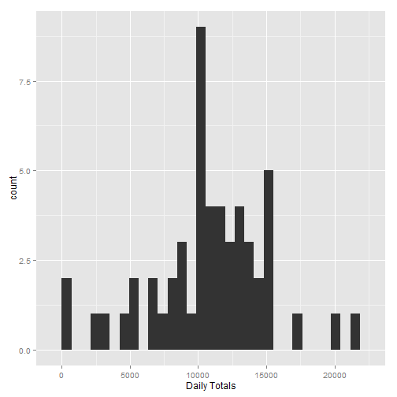
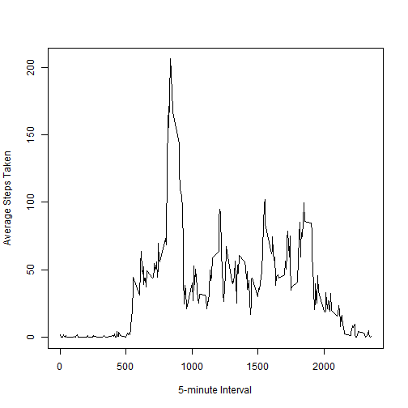
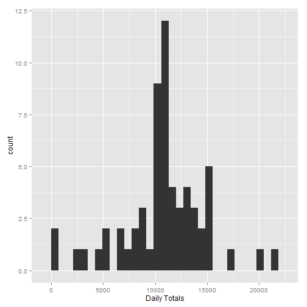
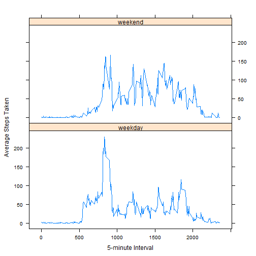

# Reproducible Research: Peer Assessment 1


## Loading and preprocessing the data

```r
data <- read.csv("activity\\activity.csv")
```


## What is mean total number of steps taken per day?

```r
library(ggplot2)

dfNoNA = data[complete.cases(data),]

dailyTotals = aggregate(dfNoNA$steps, list(dfNoNA$date), sum)

dailyTotals$Group.1 = as.Date(dailyTotals$Group.1, format = "%Y-%m-%d")

ggplot(dailyTotals, aes(x=dailyTotals$x)) + geom_histogram() + labs(x="Daily Totals")
```

```
## stat_bin: binwidth defaulted to range/30. Use 'binwidth = x' to adjust this.
```

 

```r
mean(dailyTotals$x)
```

```
## [1] 10766
```

```r
median(dailyTotals$x)
```

```
## [1] 10765
```


## What is the average daily activity pattern?

```r
intervalAvgs = aggregate(dfNoNA$steps, list(dfNoNA$interval), mean)

plot(intervalAvgs, type="l", xlab="5-minute Interval", ylab="Average Steps Taken")
```

 

###5-minute interval containing the maximum number of steps

```r
intervalAvgs[intervalAvgs$x == max(intervalAvgs$x),1]
```

```
## [1] 835
```


## Imputing missing values

###Total number of missing values in the dataset

```r
nrow(data[is.na(data$steps),])
```

```
## [1] 2304
```

###New dataset equal to the original dataset but with the missing data filled in

```r
getIntervalMean <- function(x) {
    intervalAvgs[intervalAvgs$Group.1==x,2]
}

naIndex <-data[is.na(data),]

for(i in 1:nrow(naIndex)) {
    
    data[(data$date==naIndex$date[i] & data$interval==naIndex$interval[i]),]$steps <- getIntervalMean(naIndex$interval[i])

    }

dailyTotalsImputed = aggregate(data$steps, list(data$date), sum)

dailyTotalsImputed$Group.1 = as.Date(dailyTotalsImputed$Group.1, format = "%Y-%m-%d")

ggplot(dailyTotalsImputed, aes(x=dailyTotalsImputed$x)) + geom_histogram() + labs(x="Daily Totals")
```

```
## stat_bin: binwidth defaulted to range/30. Use 'binwidth = x' to adjust this.
```

 

```r
mean(dailyTotalsImputed$x)
```

```
## [1] 10766
```

```r
median(dailyTotalsImputed$x)
```

```
## [1] 10766
```


## Are there differences in activity patterns between weekdays and weekends?

```r
daysOfWeek <- c("Monday", "Tuesday", "Wednesday", "Thursday", "Friday")

wd <- factor(c("weekday", "weekend"))

data$weekday <- wd[1]

data$weekdayKey <- ifelse(weekdays(as.Date(data$date)) %in% daysOfWeek, wd[1], wd[2])

data[data$weekdayKey==2,]$weekday <- wd[2]

library(lattice)

intervalAvgsWd = aggregate(data$steps, list(data$interval, data$weekday), mean)

 xyplot(intervalAvgsWd$x ~ intervalAvgsWd$Group.1 | intervalAvgsWd$Group.2, layout=c(1,2), type="l", xlab="5-minute Interval", ylab="Average Steps Taken")
```

 
